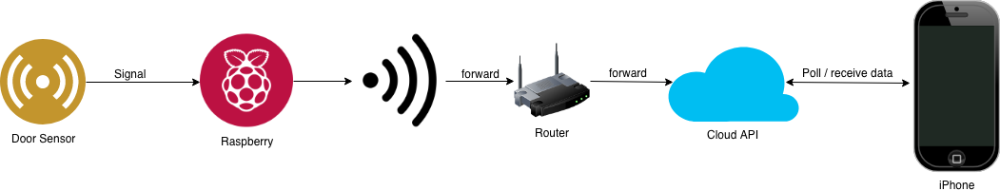

# Door-Watcher
Highly available, low cost, real time door monitoring system

## Main Idea
You have a door (your house's / apartment main door) and you want to monitor the door's status when you're not at home to see if someone breaks in without you being aware of that. 

This system is composed of a hardware component mounted on the door, a cloud VM that stores and processed all the data that is sent by the hardware and an iOS application that shows you in realtime what happens with the door.

The key targets of this system are: to be reliable (avoid false positives), real-time, extensible and low-cost.

## Tools needed
* 1 x Raspberry PI 3 model B
* A Wi-Fi network used by the Raspberry to get Internet access (could be the home network)
* 1 x Magnetic [door switch](https://www.robofun.ro/magnetic-door-switch-set)
* [Wires](https://www.robofun.ro/fire-conexiune-mama-mama-10-bucati-10cm?search=fire)
* A Mac, X-Code installed and an iPhone

## Architecture

## Embedded code architecture

[Language: Python]

The code that runs on the Raspberry is built using the Python SDK and it has 2 main tasks that need to be performed:

1. It reads the door sensor's state once per second and if the door is opened, then it makes a set (more than one) of HTTP calls to the Cloud API (for redundancy reasons) announcing that the door has been opened. We perform multiple calls to make sure that the message reached the destination successfully and it wasn't lost by network congestions or any other infrastructure-related issues.

The Cloud API will count all the HTTP calls received on that specific endpoint (/door-opened for example) and if the number of received calls is over 50% / 75% from the total number of calls that were performed by the Raspberry, then the API triggers a notification to the iOS app.

2. At a 5 seconds interval, the Raspberry performs a HTTP call to a dedicated enpoint (/heartbeat) in the Cloud API for redundancy reasons. This way, the API knows in each moment if the hardware is still there and it works as expected. This heartbeat signal will be stored on the API and the iOS app will consume it.

3. [Extra] Send the video stream from an USB camera connected to the raspberry to the API.

## IOS app architecture

[Language: Swift]

The iOS app will need to be linked to a topic in APNS that will be used to receive push-notifications from the API.

It will consists from multiple screens that will be able to provide the following functionality:

* See all the doors registered in the system
* See the last opened timestamp for each door
* Arm / Disarm the system for each door
* See the heartbeat from the system in real-time (through a pooling mechanism)
* [Extra] See in real-time the video stream from a camera connected to Raspberry

## API architecture

[Language: Go]

The API will be a Go REST API application that will run on a GCloud VM using a public endpoint that accepts connections only for an whitelisted IP (the IP of the network where the Raspberry is located).

The main tasks of the API will be the following:

* Run continuously on a dedicated port
* Accept connections on /heartbeats and /door-opened endpoints
* Provide a GET endpoint for the iOS app
* Store the heartbeats received from the hardware in a Queue or something similar
* Store the signals received from the hardware regarding the door-opened event
* Trigger a push-notification to the iOS app when the logic considers that the door has been opened
* [Extra] Forward the video stream received from the hardware to the iOS app [needs research]
